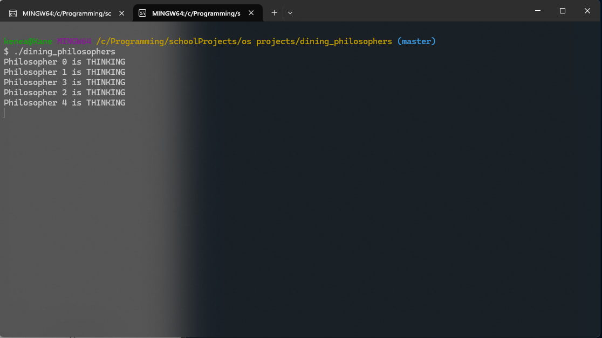
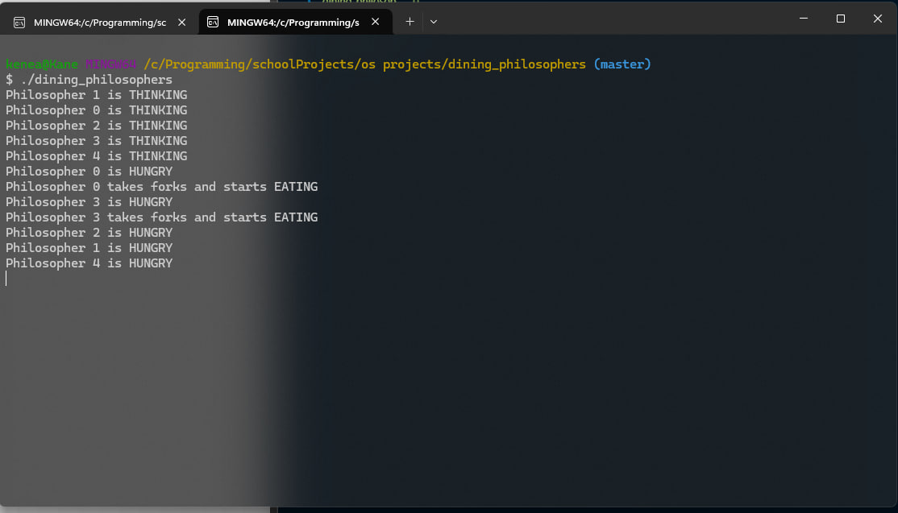
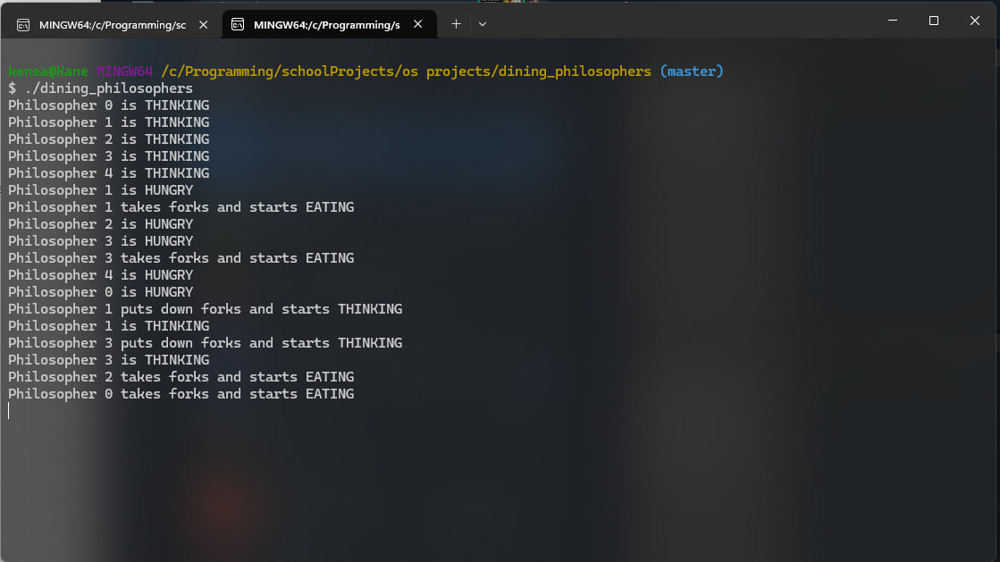
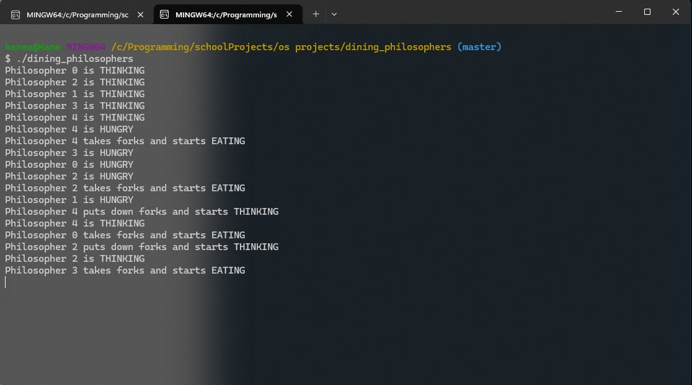

# Dining Philosophers – Pthreads in C

A simulation of the classic Dining Philosophers problem using Pthreads. This program illustrates synchronization, mutual exclusion, and deadlock avoidance in a shared-resource system, where five philosophers alternate between thinking and eating using shared forks.

## Table of Contents

- [Features](#features)
- [Technologies](#technologies)
- [How to Run](#how-to-run)
- [Examples (Screenshots)](#examplesscreenshots)
- [Project Report](#project-report)
- [Structure](#structure)
- [Group Members](#group-members)

## Features

- Simulates 5 philosophers using threads
- Uses mutexes and condition variables for synchronization
- Prevents deadlock and starvation
- Displays current state: THINKING, HUNGRY, EATING

## Technologies

- C (GCC)
- POSIX Threads (Pthreads)
- Mutexes and Condition Variables

## How to Run

### 1. Compile
gcc -o dining_philosophers dining_philosophers.c -lpthread

### 2. Then Run
./dining_philosophers

### 3. 
java ChatClient

### 4. Then to finish/quit
ctrl + c

## Examples(Screenshots)

Here are screenshots showing the execution of the chat application:

### 1. Philosopher Thinking

### 2. Philosopher Hungry

### 3. Philosopher Eating

### 4. Philosopher Puts Down Forks

## Project Report

You can download the 1-page project report here:  
[Download Report (PDF)](files/report.pdf)

## Structure

dining_philosophers/
├── files/
│ ├── screenshots/
│ │ └── 1.jpg – 4.jpg
│ └── report.pdf
├── dining_philosophers.c – Source code for the simulation
└── README.md – Project overview and instructions

## Group Members

- Anteneh Moges
- Fikir Samuel  
- Fitsum Birhanu
- Dagim Bireda  
- Kenean Alemayhu